<div align="center">

<a href="https://github.com/TrinayanMahato?tab=repositories"></a>
<a href="https://weather-app-ten-ruby-62.vercel.app"></a>

<a href="https://github.com/TrinayanMahato?tab=followers"></a>

</div>



I build backend systems and the pipelines that make them useful — REST APIs with real authorization, agent workflows that call models and then wait for a human, and the Docker and Kubernetes plumbing that gets them running somewhere other than my laptop.

The thread through most of it is **automation that knows when to stop**. An agent that shortlists candidates should pause before scheduling interviews. A SIEM that can block an IP should email a person before it blocks permanently. Those pauses are the interesting engineering.

- **Design it** — model the data first, then let the routes fall out of the schema.
- **Build it** — small services that compose, validation at the edge, errors that surface instead of hiding.
- **Run it** — containerised, reverse-proxied, with the deployment manifests committed next to the code.
- **Document it** — a README good enough that someone else can clone the repo and get it running.


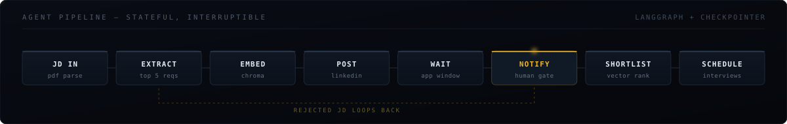

The pipeline above is from **Agentic Recruiter** and it's the piece of work I'd point at first. It's a LangGraph state machine with a checkpointer, so a run survives being paused: it genuinely stops at the human gate, persists, and resumes from that exact node when an admin approves. Reject the job description and the graph loops back to re-extract rather than starting over.


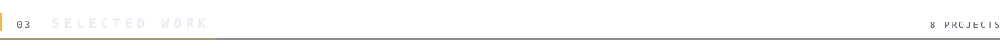

<table>
<tr>
<td width="50%" valign="top"><a href="https://github.com/TrinayanMahato/Agentic_recruiter">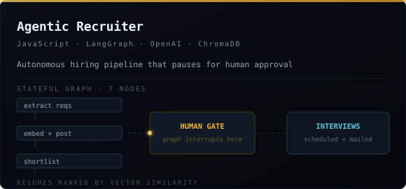</a></td>
<td width="50%" valign="top"><a href="https://github.com/TrinayanMahato/SIEM">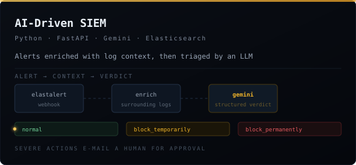</a></td>
</tr>
<tr>
<td width="50%" valign="top"><a href="https://github.com/TrinayanMahato/Admission-module">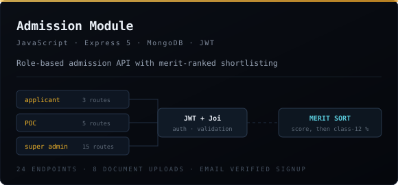</a></td>
<td width="50%" valign="top"><a href="https://github.com/TrinayanMahato/threads-exchange-hub">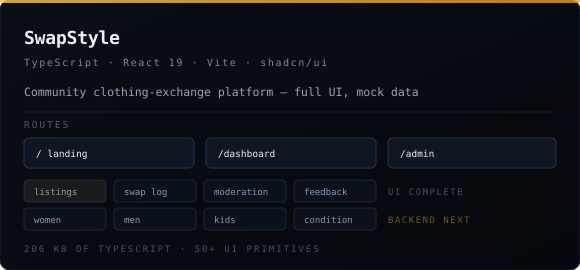</a></td>
</tr>
<tr>
<td width="50%" valign="top"><a href="https://github.com/TrinayanMahato/weather_app">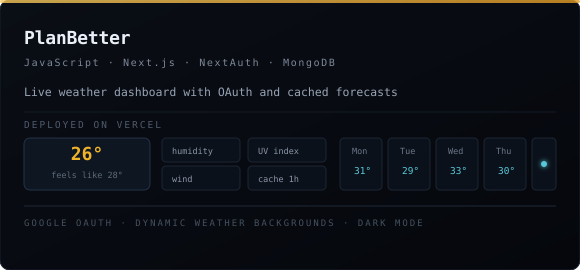</a></td>
<td width="50%" valign="top"><a href="https://github.com/TrinayanMahato/Hands_on_Kubernetes">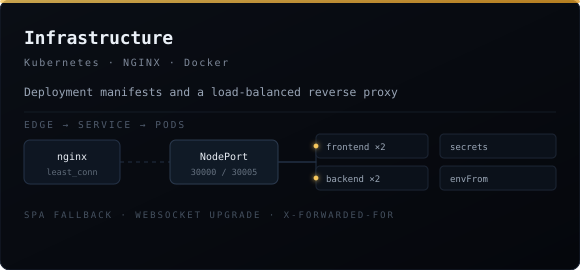</a></td>
</tr>
</table>

<details>
<summary><samp><b>&#9656;&nbsp; EVERY REPOSITORY</b></samp></summary>

<br>

| Repository | What it is | Stack |
| :--- | :--- | :--- |
| [**Agentic_recruiter**](https://github.com/TrinayanMahato/Agentic_recruiter) | LangGraph agent that parses a JD, writes the job post, shortlists resumes by vector similarity and schedules interviews — pausing for human approval. | LangGraph · OpenAI · ChromaDB · Express |
| [**SIEM**](https://github.com/TrinayanMahato/SIEM) | Webhook receiver that enriches security alerts with surrounding Elasticsearch logs, asks Gemini for a structured verdict, and enforces it via `pfctl`. | FastAPI · Gemini · Elasticsearch · Prisma |
| [**Admission-module**](https://github.com/TrinayanMahato/Admission-module) | 24-endpoint admission API — email-verified signup, document uploads, department/course management, merit-ranked shortlisting. | Express 5 · MongoDB · JWT · Joi |
| [**threads-exchange-hub**](https://github.com/TrinayanMahato/threads-exchange-hub) | *SwapStyle* — clothing-exchange platform with user and admin dashboards, listings and swap history. | React 19 · TypeScript · Vite · shadcn/ui |
| [**weather_app**](https://github.com/TrinayanMahato/weather_app) | *PlanBetter* — weather dashboard with Google OAuth, 5-day forecast and a 1-hour client cache. **[Live →](https://weather-app-ten-ruby-62.vercel.app)** | Next.js · NextAuth · MongoDB |
| [**sitaics_project**](https://github.com/TrinayanMahato/sitaics_project) | University admin dashboard — MoUs, courses and participants, with bulk Excel import and email-approved admin registration. | Express · MongoDB · SheetJS |
| [**Hands_on_Kubernetes**](https://github.com/TrinayanMahato/Hands_on_Kubernetes) | Deployment manifests for a two-tier app — Deployments, Services, NodePort exposure and Secrets. | Kubernetes |
| [**NGINX-with-CI-CD**](https://github.com/TrinayanMahato/NGINX-with-CI-CD) | Reverse proxy and load balancer for a MERN stack — SPA fallback, WebSocket upgrade, forwarded client headers. | NGINX |

</details>



<table>
<tr><td align="right" width="150"><samp><b>LANGUAGES</b></samp></td><td>


</td></tr>
<tr><td align="right"><samp><b>BACKEND</b></samp></td><td>


</td></tr>
<tr><td align="right"><samp><b>AI &amp; AGENTS</b></samp></td><td>


</td></tr>
<tr><td align="right"><samp><b>FRONTEND</b></samp></td><td>


</td></tr>
<tr><td align="right"><samp><b>DATA</b></samp></td><td>


</td></tr>
<tr><td align="right"><samp><b>INFRA</b></samp></td><td>


</td></tr>
</table>


<div align="center">


</div>

<!-- Contribution snake: run Actions → "Generate Snake Animation" → Run workflow once,
     then uncomment the block below and it will render.

<div align="center">
<picture>
  <source media="(prefers-color-scheme: dark)" srcset="https://raw.githubusercontent.com/TrinayanMahato/TrinayanMahato/output/github-snake-dark.svg" />
  
</picture>
</div>
-->


```console
$ tail -f ~/now.log

[ACTIVE]  Agentic Recruiter  :: hardening the resume-ranking pass, fixing the wait window
[ACTIVE]  SIEM               :: moving from dry-run to live enforcement behind approvals
[ACTIVE]  SwapStyle          :: designing the API the finished frontend is waiting on
[LEARNING] Kubernetes        :: ingress, probes and resource limits beyond NodePort
[LEARNING] System design     :: queues, caching layers and where state actually belongs
[ONGOING] Documentation      :: every repo gets a README someone else can follow
```

<table>
<tr>
<td width="50%" valign="top">

**Open to**

- Backend and full-stack internships or junior roles
- Projects involving LLM agents, RAG or retrieval pipelines
- Anything where the infrastructure is part of the job
- Collaborating on tools that other people will actually run

</td>
<td width="50%" valign="top">

**How I work**

- Data model first — routes follow from the schema
- Validation at the edge, errors that surface loudly
- A human approves anything irreversible
- Committed deployment config, not a README full of manual steps

</td>
</tr>
</table>


<div align="center">

<a href="https://github.com/TrinayanMahato"></a>
<a href="https://weather-app-ten-ruby-62.vercel.app"></a>


</div>
